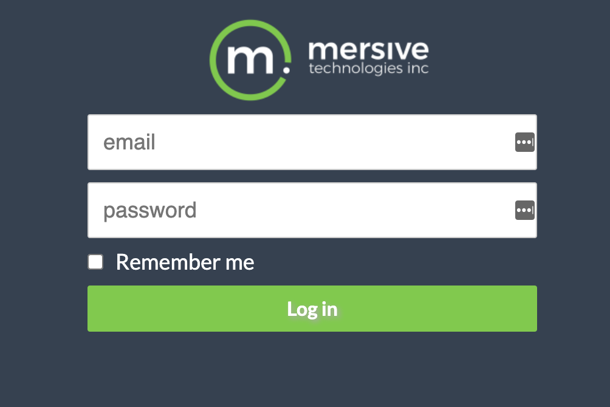
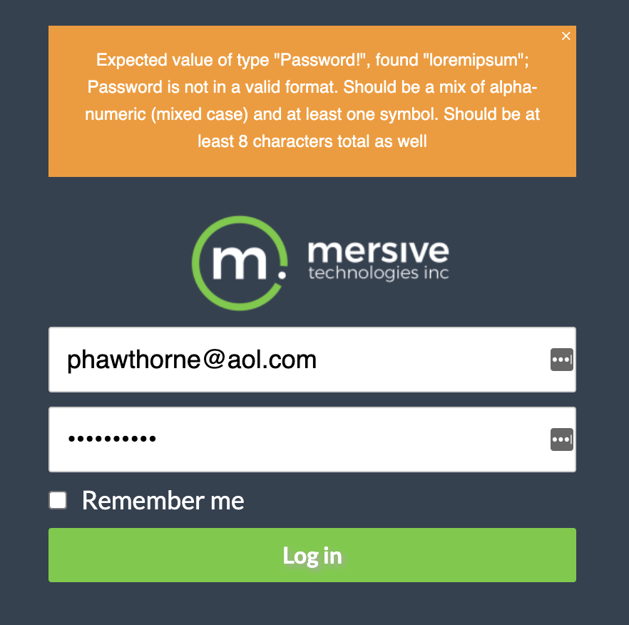
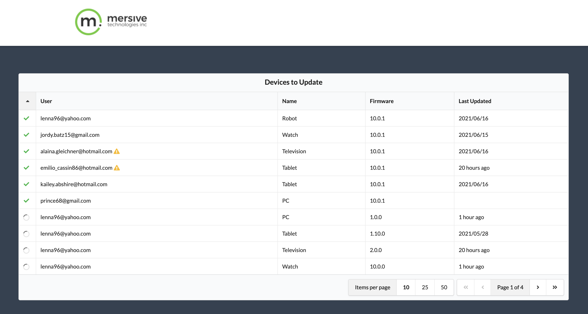

# Mersive Interview Project

You’ve been tasked with creating a feature to help clients manage firmware updates for their organization’s devices.

To accomplish this, we’ve created a sortable table component. We’d like to populate this table with device and update data from the database.

To start the server, run `npm run serve` from the project root. Currently, this serves a basic GraphQL endpoint with the device names. You may use the included RESTful example instead, or another strategy if you prefer.

This server has access to a sqlite3 database with all the necessary data, seeded by the queries in the `sql` folder. Create additional functions or views as needed, but do not modify the existing schema or data.

To view the client in a browser, run `npm run start` from the root. When you're finished, this client should consume data from the local server and implement sorting and pagination.

Feel free to make any changes to the existing code and include new modules as needed, but keep best practices and future scalability in mind.

The table has the following columns:

#### Status (Unlabeled)

Our existing firmware versions can be found in the database. Devices that are on the latest version will have a green checkmark in this column.

Devices with an in-progress update will display a loading icon. Updates are in-progress if no “finished” value is present in the database.

For other devices, this column can be blank.

When sorted in ascending order, checkmarks should come first, followed by loading icons, then empty rows.

#### User

This column displays the email address of the device’s user.

If the device’s user cannot perform updates, this column will also include a warning icon. Users can perform updates if they have an “update” permission or if they are an admin.

#### Firmware

This column displays the device’s current version, formatted like “1.2.3”.

When sorted, 10.1.1 should be higher than 9.1.1.

(See https://semver.org/ for more explanation of this convention.)

#### Last Updated

This column’s value is based on the most recent “finished” time for a completed update.

For updates completed within the past day, this can be formatted as “X Hour(s) Ago”. Otherwise just display the date, i.e. ”YYYY/MM/DD”.

**Note: This table should not include devices of users whose subscription end dates have passed.**

# Usage

To run this application locally

1. Prepare the database: `npm run prepare`
2. Start the server: `npm run serve:dev`
3. Start the client: `npm start`
4. Use one of the user email addresses to login and provide a password (any will do) which is mixed-case alpha-numeric with 1 (or more) symbol (at least 8 characters total)

# UI Walkthrough

The UI consists of a single page containing a datatable. The rows in the datatable are the individual devices for each user (with an active subscription). To access this page you must first login

### Login Page

A mock user authentication layer has been put in place for this exercise. This was mainly to be able to demonstrate the use of GraphQL authorization/authentication directives and how to wire them into the React app.

When presented with the login screen, try logging in as one of the admin users and later as a non-admin users (to demonstrate the filtering of devices for non-admin users to only their personal devices).

You don't have to enter a specific password because no password hashing was implemented in the database layer. Rather you just need to enter a password that passes the pattern constraints defined in the GraphQL `Password` scalar resolver (try entering anything, and if the pattern constraints aren't met, you'll see an error message explaining what was invalid).

The Login page is caused to appear if there is no token in local storage and/or no token in the React component local state for the App component.

### Device Updates Page

Once authenticated you'll be able to view all the update status for all user devices. If you are not an administrator however, you'll see only the update status for your own devices.

If a user associated with one of the device updates is not able to perform their own updates a caution icon will display next to their email address listed in the table.

The status of each device update is display by either a green checkmark (meaning they are "up-to-date"), a spinner (if their update is "in progress") or no icon if they are behind and have not yet updated the device.

# API Walkthrough

The API is a GraphQL service which talks to a SQLLite database.

### Directives

Several custom directives were created:

* `@isAuthenticated` - Designates a query/field which is only accessible by authenticated users
* `@isAdmin` - Designates a query/field which is only accessible by administrators
* `@isDeviceUser` - Designates a query/field which is only accessible by to users associated with the particular device(s) that are the subject of the query

### Custom Scalar Resolvers

Several custom scalar resolvers were created:

* `Email` - A custom scalar resolver which ensures a value is an email address
* `Jwt` - A custom scalar resolver which ensures a value is a JWT access token
* `NonNegativeInt` - A custom scalar resolver which ensures a value is non-negative integer
* `Password` - A custom scalar resolver which ensures a value is a password
* `PositiveInt` - A custom scalar resolver which ensures a value is positive integer
* `Semver` - A custom scalar resolver which ensures a value is a semantic version

### Additional Queries & Mutations

Several additional Queries & Mutations were created:

* `getDevicesByEmail` - Retrieves the devices associated with a given user
* `getUserByEmail` - Retrieves a user record by their unique email address
* `getDeviceById` - Retrieves a device record by its unique ID
* `getExpiredUsers` - Retrieves a list of users whose subscription has ended
* `getLatestFirmwareVersion` - Retrieves the latest firmware version
* `verifyToken` - Validates an access token, making sure it was issued by this server and hasn't expired
* `login` - Registered users authenticate with their email and password

They have each been decorated with the appropriate directive to control access.

### Dataloaders

To avoid over-fetching (ran into it when pulling back a list of devices since many devices have the same user), you can [memoize the function which fetches a user or device](https://www.npmjs.com/package/dataloader). That way the database is only called once rather than for each time that user/device is encountered.

This is not the same as caching with Redis/memcached but rather an in-memory memoization cache spun up per each inbound GraphQL request.

### Environemnt Variable Validation

The server also uses [schema validation for environment variables](https://www.npmjs.com/package/envalid) (in the `src/server/config/env.js` from which the app config is derived). Tools like this allow validation of values to ensure they are numbers, strings, booleans, URLs, port numbers, etc. Additionally, it allows setting default values, providing docs and a helpful description so that failures write a useful message to the console (failures will cause the server to also not start).

### Auth

Although a database model change would be needed to implement salting & hashing of users passwords, all the rest of authentication/authorization pieces except for that part have been implemented.

* Issues [JWT formatted](https://jwt.io) access tokens signed with a secret value provided in the env vars
* Scopes the access tokens with permissions of `can_view_own_devices` and/or `can_perform_updates` which the client can use to determine whether to call for and display all devices or only those user's devices
* Provides the client the ability to validate and decode access tokens, and ensure they were issued by the server
* The server and client both check that the token hasn't expired and use that to validate a current session

### Data access layer

In an effort to keep the GraphQL resolvers "de-coupled" from the particular database, all the data access tasks have been abstracted away into a "client", effectively separting data access into its own layer. This makes it much easier to write unit and integration tests, but also allows the freedom to switch databases in the future without causing refactoring chores throughout the entire server (ie it limits the number of files which are coupled to the current database technology).

### Input validation

The GraphQL resolvers and the DB client methods employ input validation (if you
don't see any in a GraphQL Query resolver it's because either a custom scalar resolver is handling it already upstream or a DB client method is handling it downstream). These will validat the presence of required fields and pattern match them, and issue descriptive error messsages back down to the client (without leaking out sensitive DB details.

### Threshold based Logging

Logging statements have been added throughout the DB client methods but have been put in so that they can be toggled off by simply changing the `LOG_LEVEL` environment variable. Verbose logging statements are written into the code to correspond to the "debug" level, but applications typically operate at a higher level of "info" (effectively silencing the "debug" statements yet allowing you to turn them back on again with a simple env var change).

To prevent sensitive database details from leaking out to the client, errors in the DB client are caught and logged but not bubbled up to be sent back in a JSON response.

These are the available threshold levels:

* `trace`
* `debug` - A bunch of logging statements are written in at this level
* `info` - The default
* `warn`
* `error`
* `fatal`
